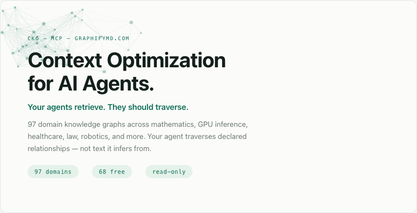
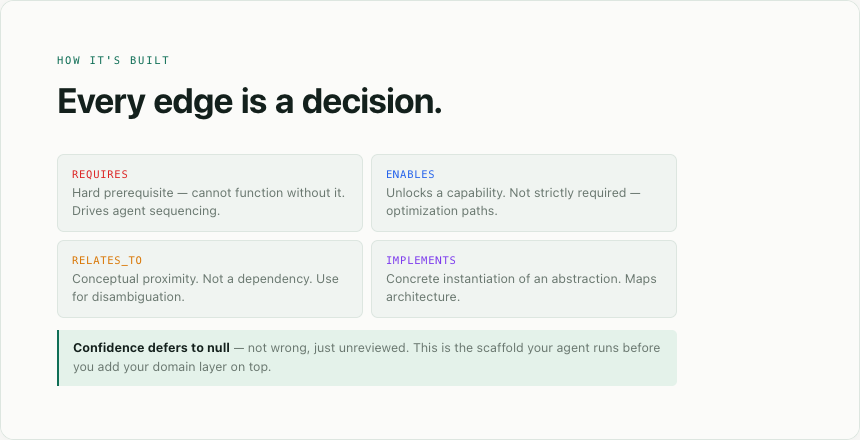
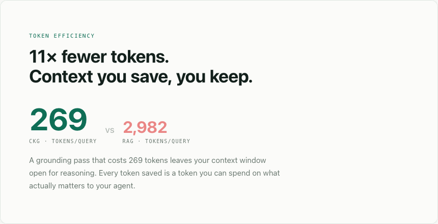

<!-- mcp-name: io.github.Yarmoluk/ckg-mcp -->

<div align="center">

# Context Optimization for AI Agents

### Agent traversal · Agent team orchestration · 97 domains · MCP-native

**Your agents retrieve. They should traverse.**

[](https://pypi.org/project/ckg-mcp/)
[](https://pypi.org/project/ckg-mcp/)
[](https://pypi.org/project/ckg-mcp/)
[](LICENSE)
[](https://graphifymd.com)
[](https://pypi.org/project/ckg-mcp/)
[](https://github.com/Yarmoluk/ckg-benchmark/blob/main/paper/main.pdf)
[](https://github.com/Yarmoluk/ckg-benchmark/blob/main/paper/main.pdf)
[](https://graphifymd.com)

> **Read-only.** The server can only return edges that exist in the data.
> It returns nothing rather than inferring a path that isn't there.

[**Get Pro →**](https://graphifymd.com/pro) · [**Benchmark →**](https://github.com/Yarmoluk/ckg-benchmark/blob/main/paper/main.pdf) · [**graphifymd.com →**](https://graphifymd.com)

</div>

<div align="center">
  <a href="https://yarmoluk.github.io/ckg-mcp/carousel.html">
    
  </a>
</div>

---

## Context Optimization — The Problem

Every agent that reasons about a domain — HIPAA, GPU inference, calculus, contract law — does one of three things:

| Approach | What breaks |
|---|---|
| Long system prompt | No structure. Drifts with every model update. Cannot traverse. |
| RAG retrieval | Probabilistic. Accuracy degrades at each hop. Expensive per query. |
| Fine-tuning | 6-month cycle. Stale by delivery. Retrains when knowledge shifts. |

All three share the same failure: the agent **re-infers** domain structure on every query instead of reading structure that was declared once.

In our open benchmark (KRB v0.6.2 — [reproduce it yourself](https://github.com/Yarmoluk/ckg-benchmark)):
RAG achieves **0.123 macro F1** on multi-hop domain queries. CKG achieves **0.471**. At 5 hops, the gap widens: RAG 0.170, CKG 0.772.

The token cost compounds the accuracy problem: the average RAG query costs **2,982 tokens**. The average CKG traversal costs **269** — measured across 19 benchmark domains.

These numbers are ours, on our benchmark. The dataset is [public on HuggingFace](https://huggingface.co/datasets/danyarm/ckg-benchmark). Run it yourself.

---

## Agent Traversal — The Solution

A **Compressed Knowledge Graph (CKG)** is a domain structured for traversal, not retrieval.

Not a document. Not a vector index. A pre-compiled DAG of concepts, typed dependency relationships, and prerequisite chains — compressed to the minimum tokens that carry the maximum structure. Served over MCP. Traversed deterministically.

```
Agent asks:   "What does TensorRT-LLM require to run on Hopper?"

CKG returns:  TensorRT-LLM
              ├─ [REQUIRES] CUDA Toolkit
              │    ├─ [ENABLES] cuBLAS
              │    └─ [ENABLES] CUDA Driver API
              ├─ [REQUIRES] FP8/FP4 Quantization
              │    └─ [REQUIRES] Hopper SM90 Architecture
              └─ [ENABLES] Triton Inference Server
                   └─ [ENABLES] NIM Microservice Runtime

              269 tokens · declared edges only · no inference at query time

RAG would:    ~2,982 tokens · probabilistic retrieval · degrades at 3+ hops
```

**You go from prompting the domain into existence to asking questions inside it.**

---

## One Use Case — Becoming Nemotron-Enabled

Perplexity is a model aggregator. Shortest route to Nemotron — click the dropdown, select the model, query. But it's their pipeline, their infrastructure. Your queries go through their system.

If you want to run Nemotron yourself — sovereign, private, on your own hardware — you need to navigate NVIDIA's stack: NGC API key, NIM container, Enterprise License, inference endpoint. The dependency chain is non-obvious. Most developers hit the wrong door first.

**Without CKG:** search the docs, hit the Enterprise License wall, spend two hours finding `build.nvidia.com`.

**With CKG:**
```
query_ckg("Nemotron Model", "nvidia-nim")
→ [REQUIRES] Model Weights
  → [REQUIRES] NGC Container Registry
    → [REQUIRES] NGC API Key        ← start here

query_ckg("NIM Docker Container", "nvidia-nim")
→ [REQUIRES] NGC API Key
→ [REQUIRES] NVIDIA AI Enterprise License   ← production path
→ [ENABLES]  NIM Microservice               ← what you're building toward
```

Two traversals. Correct path. No wrong doors. The graph knew — the model just told you.

### Typed edges carry semantic meaning

| Edge type | Meaning | Agent use |
|---|---|---|
| `REQUIRES` | Hard prerequisite — must exist first | Sequencing, gap detection |
| `ENABLES` | Unlocks a downstream capability | Optimization paths |
| `RELATES_TO` | Conceptual proximity | Disambiguation |
| `IMPLEMENTS` | Concrete realization of an abstraction | Architecture mapping |
| `CONTRASTS_WITH` | Meaningful opposition | Tradeoff reasoning |

### Every domain is a plain-text DAG

```
ConceptID, ConceptLabel,      Dependencies,      TaxonomyID
1,         Taylor Series,     "",                Analysis
2,         Power Series,      "",                Analysis
3,         Convergence,       "2:REQUIRES",      Analysis
4,         Higher-Order Der., "5:REQUIRES",      Calculus
5,         Derivative,        "6:REQUIRES",      Calculus
6,         Continuity,        "7:REQUIRES",      Calculus
```

No embeddings. No probabilistic retrieval. Built once, reviewed once, traversed forever.

<div align="center">
  
</div>

---

## Agent Team Orchestration — The Scale Story

Single-agent traversal is the efficiency gain. Multi-agent orchestration is where it compounds.

Liu et al. ([arXiv:2606.30986](https://arxiv.org/abs/2606.30986)) measure **Context Transaction Cost (CTC)**: the tax paid every time context crosses an agent boundary. Their finding: context efficiency collapses from 18.2 in Q1 to 1.6 by Q4 across pipeline stages — **91% degradation with no model change**.

CKG addresses all three root causes they identify:

| CTC component | What it is | CKG's response |
|---|---|---|
| Token Latency Burden | Compute cost of transmitting context | 269 tokens instead of 2,982 |
| Handoff Cost | Serialization loss at agent boundaries | `get_prerequisites()` replaces re-retrieval |
| Compression Loss | Information destroyed when context is summarized | The graph is the compressed form — done once, offline |

When agent A hands off to agent B, neither re-retrieves the domain. They both traverse the same declared graph. **Structured context doesn't consume your context window — it opens it.**

<div align="center">
  
</div>

---

## Quickstart

```bash
uvx ckg-mcp          # no install — runs immediately
# or
pip install ckg-mcp  # Python ≥ 3.10
```

### Claude Desktop

```json
{
  "mcpServers": {
    "ckg": { "command": "uvx", "args": ["ckg-mcp"] }
  }
}
```

### Claude Code

```bash
claude mcp add ckg -- uvx ckg-mcp
```

### Cursor / Cline / Windsurf / any MCP client

```json
{ "mcpServers": { "ckg": { "command": "uvx", "args": ["ckg-mcp"] } } }
```

### System prompt snippet

```
You have access to the ckg MCP server — a typed dependency graph catalog
of 97 domains (mathematics, GPU inference, healthcare, law, robotics,
regulatory, AI tooling, and more). When answering questions about any of
these domains, call query_ckg() or get_prerequisites() before responding.
Do not infer dependency chains — traverse the graph instead.
```

### Try it immediately

```
list_domains()
→ see all 68 free domains

query_ckg("Taylor Series", "calculus", 3)
→ prerequisite chain: Function → Limit → Continuity → Derivative →
  Higher-Order Derivatives → Convergence → Power Series → Taylor Series

get_prerequisites("Business Associate Agreement", "hipaa-compliance")
→ Covered Entity → PHI Definition → Minimum Necessary Standard →
  Access Controls → Breach Notification Rule → BAA

query_ckg("FlashAttention-3", "nvidia-gpu-inference", 3)
→ SRAM Tiling · On-Chip Memory Budget · Transformer Attention ·
  Softmax Stability → FlashAttention-3 → Multi-Head Attention → KV Cache
```

---

## Benchmark

> These are our numbers on our open benchmark. The dataset is on HuggingFace. Run it yourself before citing them.

```bash
git clone https://github.com/Yarmoluk/ckg-benchmark && cd ckg-benchmark
pip install -r evaluation/requirements.txt
python evaluation/ckg_harness.py --domain calculus
python evaluation/analyze_results.py
```


| System | Macro F1 | Tokens / query | Cost / 1K queries | F1 at 5 hops |
|---|---|---|---|---|
| **CKG (this package)** | **0.471** | **269** | **$7.81** | **0.772** |
| RAG (text-embedding-3-small) | 0.123 | 2,982 | $76.23 | 0.170 |
| GraphRAG (MS global, v1.1) | 0.120 | 3,450+ | — | — |

**What this means:**
- **4× F1** — in our benchmark, on our dataset. Open and reproducible.
- **11× fewer tokens** — the 269 and 2,982 figures are averages across 19 benchmark domains.
- **F1 rises with depth** — CKG 0.37 at 1 hop → 0.77 at 5 hops. RAG is flat. Graph traversal does not degrade at depth; retrieval does.
- **GraphRAG** — not a meaningful improvement over RAG at higher token cost. The word "graph" is not the win. A pre-compiled, declared graph is.

One derived metric we use internally: **Retrieval Density Score** (F1 ÷ tokens per query). CKG scores roughly 42× higher than RAG on this ratio. It is not a standard benchmark metric — we use it to reason about accuracy-per-token efficiency.

[Full benchmark paper →](https://github.com/Yarmoluk/ckg-benchmark/blob/main/paper/main.pdf)

---

## Domain Library

### 68 free · no API key required

**Mathematics**
`calculus` · `pre-calc` · `algebra-1` · `linear-algebra` · `geometry-course` · `statistics-course` · `functions` · `fft-benchmarking`

**Engineering & Computer Science**
`circuits` · `digital-electronics` · `computer-science` · `quantum-computing` · `signal-processing` · `intro-to-graph`

**Life Sciences**
`biology` · `bioinformatics` · `genetics` · `ecology` · `chemistry`

**Clinical & Health (free)**
`glp1-obesity` · `glp1-muscle-loss` · `dementia`

**Regulatory & Government**
`fda-drug-approval-chain` · `fda-adverse-event-chain` · `federal-procurement-chain` · `gao-oversight-chain`

**AI, ML & Data**
`machine-learning-textbook` · `data-science-course` · `conversational-ai` · `langchain-core` · `dbt-core` · `apache-iceberg`

**AI Tools (provider graphs)**
`claude-anthropic` · `claude-skills` · `cursor` · `deepseek` · `gemini-api` · `grok-xai` · `kimi-moonshot` · `midjourney` · `openai-platform` · `qwen` · `vercel-ai-sdk`

**Robotics & Physical AI**
`ros2-architecture` · `robot-motion-planning`

**Learning & Pedagogy**
`prompt-class` · `tracking-ai-course` · `automating-instructional-design` · `microsims` · `infographics` · `it-management-graph`

**Business & Society**
`economics-course` · `personal-finance` · `ethics-course` · `theory-of-knowledge` · `systems-thinking` · `digital-citizenship` · `blockchain` · `unicorns`

**Reference & Culture**
`art-of-war` · `laudato-si` · `learning-linux` · `us-geography` · `asl-book` · `reading-for-kindergarten` · `moss`

---

### Free vs Pro

| | **Free — MIT** | **Pro — $99/mo** |
|---|---|---|
| Domains | 68 | **97** |
| Healthcare & clinical | — | HIPAA · CPT coding · ICD-10 · payer formulary · drug interactions · clinical decision chain · medical billing |
| Enterprise data stack | — | Databricks Unity · Snowflake Horizon · PostgreSQL · AWS Data Catalog · Azure Purview · GCP Dataplex · OpenLineage |
| AI infrastructure | — | NVIDIA GPU inference · context-as-a-service · agent reliability · AI governance · token cost crisis |
| Legal & compliance | — | Legal citation chain · contract law elements · AML/KYC chain · investment risk chain |
| Agent blueprints | 2 | 2 + priority access |
| Domain updates | Community | Managed |
| License | MIT | Commercial |

**Activate in 60 seconds:**

```bash
export CKG_API_KEY=cs_live_your_key_here
# restart your MCP client — all 97 domains appear in list_domains()
```

[**Get Pro → graphifymd.com/pro**](https://graphifymd.com/pro)

---

## Agent Blueprints

Pre-built agent specs: which domains to load, step-by-step workflow, ready-to-paste system prompt, and a LangGraph orchestration hint. Skip writing the context layer from scratch.

```
list_agent_blueprints()
→ gpu-inference-optimizer      — trace GPU bottlenecks, surface optimization paths
  context-as-a-service-advisor — design CKG-based retrieval pipelines

get_agent_blueprint("gpu-inference-optimizer")
→ Required domains: nvidia-gpu-inference, context-as-a-service
  Workflow: diagnose → trace prerequisites → identify path → recommend
  Prompt template: [ready to paste]
  LangGraph hint: StateGraph · 4 nodes
```

---

## The Six Tools

All read-only. No database. No embeddings. No API key for free domains.

| Tool | What it does |
|---|---|
| `list_domains()` | Every available domain. **Start here.** |
| `query_ckg(concept, domain, depth)` | Prerequisites + dependents, up to N hops |
| `get_prerequisites(concept, domain)` | Full upstream chain in dependency order |
| `search_concepts(query, domain)` | Find concepts by keyword — use before query_ckg |
| `list_agent_blueprints()` | Browse pre-built agent configs |
| `get_agent_blueprint(use_case)` | Full spec: domains, workflow, prompt, LangGraph hint |

---

## Why Graphify.md

**ckg-mcp is the core product of [Graphify.md](https://graphifymd.com).**

We build the context optimization layer that sits between agents and the domains they operate in. The same layer that powers this package runs inside enterprise deployments, sealed appliances, and custom vertical CKGs.

**What we can say without overstating:**
- The benchmark is open and reproducible — not self-reported, verifiable
- The graphs are human-authored and human-reviewed — not generated
- The methodology is patent pending — not just a wrapper around an existing system
- Plain CSV DAGs, MIT-licensed for free domains — no lock-in

**Compatibility — model-agnostic:**

| LLM | Agent framework | MCP client |
|-----|-----------------|------------|
| Claude (all tiers) | LangChain / LangGraph | Claude Desktop |
| GPT-4o / GPT-4 | AutoGen | Claude Code |
| Gemini 2.0 / 2.5 | smolagents | Cursor |
| Llama 3.x | CrewAI | Cline |
| Mistral / DeepSeek | OpenAI Agents SDK | Any MCP stdio client |

No graph database. No vector store. Python ≥ 3.10. Single dependency (`mcp`). stdio transport.

---

## Custom Domains & Enterprise

The free and Pro catalog covers breadth. Enterprise needs are specific: your regulatory environment, your internal taxonomy, your product domain, your data stack.

**[Graphify.md](https://graphifymd.com)** builds and maintains custom CKG domain graphs for enterprise teams — compressed, versioned, deployed over your MCP stack.

**Sealed Appliance** — a private CKG + query server in your environment. Air-gapped. Your data stays yours.

Typical entry: a pilot on your highest-value domain, delivered in one session, measured against your existing retrieval setup.

---

## Corrections Welcome

Spotted a wrong edge? A `RELATES_TO` that should be `REQUIRES`? A missing concept?

Edge corrections are the highest-value contribution — the graph gets more useful with every fix. Open an issue or PR on [GitHub](https://github.com/Yarmoluk/ckg-mcp).

---

## Ecosystem

| Package | What it does |
|---|---|
| **[ckg-mcp](https://pypi.org/project/ckg-mcp/)** | This repo — 97 domains, context optimization layer |
| **[ckg-nvidia-ai](https://pypi.org/project/ckg-nvidia-ai/)** | 20 NVIDIA AI domains, free, MCP-native |
| **[agentmem-mcp](https://github.com/Yarmoluk/agent-memory-mcp)** | Cross-session agent memory |
| **[KRB Benchmark](https://huggingface.co/datasets/danyarm/ckg-benchmark)** | Open benchmark — reproduce the F1 numbers |
| **[ckg-eval](https://github.com/Yarmoluk/ckg-eval)** | Path-Fidelity Score — reasoning path correctness |

---

## EVAL

```
benchmark: ckg-benchmark v0.6.2
dataset: huggingface.co/datasets/danyarm/ckg-benchmark
benchmarked: true
this_domain_f1: 0.471
queries_tested: 19
rag_baseline_f1: 0.123
graphrag_baseline_f1: 0.120
mean_tokens: 269
paper: github.com/Yarmoluk/ckg-benchmark/blob/main/paper/main.pdf
```

---

## Citation

```bibtex
@misc{yarmoluk2026ckg,
  title  = {Benchmarking Knowledge Retrieval Architectures Across Educational
            and Commercial Domains: RAG, GraphRAG, and Compressed Knowledge Graphs},
  author = {Yarmoluk, Daniel and McCreary, Dan},
  year   = {2026},
  note   = {v0.6.2. https://github.com/Yarmoluk/ckg-benchmark}
}
```

---

<div align="center">

**[graphifymd.com](https://graphifymd.com) · [Pro](https://graphifymd.com/pro) · [Benchmark](https://github.com/Yarmoluk/ckg-benchmark/blob/main/paper/main.pdf)**

*Patent pending. Built by [Daniel Yarmoluk](https://graphifymd.com) / Graphify.md.*

</div>
